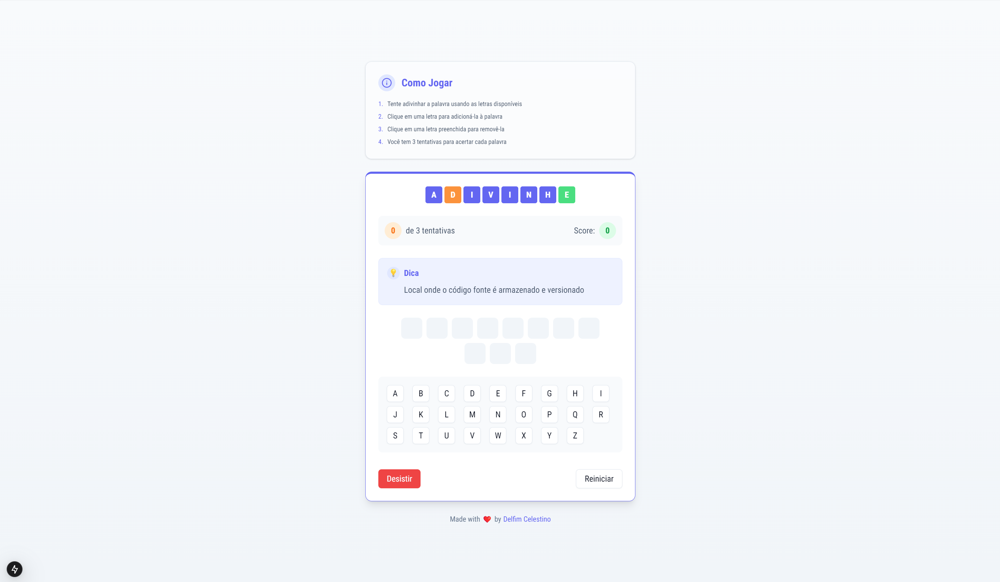

# Dev Words 🎮

Um jogo de palavras para desenvolvedores, onde você precisa adivinhar termos comuns da programação. Teste seus conhecimentos sobre conceitos fundamentais de desenvolvimento de software!



## 🎯 Características

- Interface intuitiva e responsiva
- Palavras aleatórias a cada jogo
- Feedback visual imediato
- Dicas para cada palavra
- Sistema de pontuação
- Design moderno e minimalista
- Totalmente em português

## 🚀 Tecnologias

- [Next.js 14](https://nextjs.org/)
- [React](https://reactjs.org/)
- [TypeScript](https://www.typescriptlang.org/)
- [Tailwind CSS](https://tailwindcss.com/)
- [Shadcn/ui](https://ui.shadcn.com/)

## 🎮 Como Jogar

1. Tente adivinhar a palavra usando as letras disponíveis
2. Clique em uma letra para adicioná-la à palavra
3. Clique em uma letra preenchida para removê-la
4. Você tem 3 tentativas para acertar cada palavra
5. Acerte para ganhar pontos e avançar para a próxima palavra

## 🛠️ Instalação

```bash
# Clone o repositório
git clone https://github.com/DelfimCelestino/Wordle.git

# Entre no diretório
cd dev-words

# Instale as dependências
npm install

# Inicie o servidor de desenvolvimento
npm run dev
```

Abra [http://localhost:3000](http://localhost:3000) no seu navegador para ver o resultado.

## 📝 Licença

Este projeto está sob a licença MIT. Veja o arquivo [LICENSE](LICENSE) para mais detalhes.

## 🤝 Contribuição

Contribuições são sempre bem-vindas! Por favor, leia o [guia de contribuição](CONTRIBUTING.md) primeiro.

## 👨‍💻 Autor

Feito com ❤️ por [Delfim Celestino](https://github.com/delfimcelestino)

---

⭐️ Se você gostou deste projeto, por favor, dê uma estrela!
